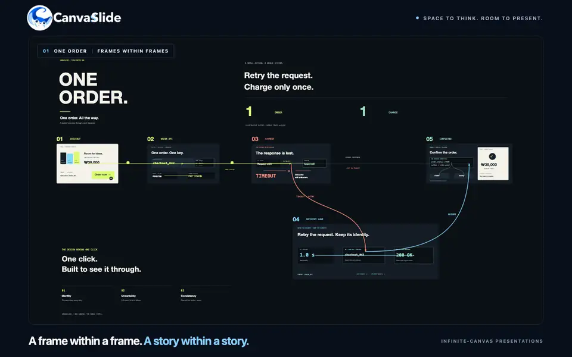

# CanvaSlide

[English](./README.md) | **한국어**

macOS와 Windows용 무한 캔버스 프레젠테이션 앱입니다. 하나의 보드에 텍스트·도형·미디어를 배치하고,
보여줄 영역에 **프레젠테이션 프레임**을 놓은 뒤 **슬라이드 쇼**를 시작하면 카메라가 프레임 사이를
연속적으로 확대·이동합니다. **Tauri 2 + React 19 + TypeScript**로 만들었으며 브라우저에서도 실행됩니다.



[ShowCase](https://hwantage.github.io/CanvaSlide/showcase/) ·
[웹 편집기 열기](https://canvaslide.pages.dev/) ·
[릴리즈 다운로드](https://github.com/hwantage/CanvaSlide/releases) ·
[사용 안내](https://hwantage.github.io/CanvaSlide/docs/?lang=ko) ·
[문서 목록](./docs/README.md)

## 왜 CanvaSlide인가?

- **전체 맥락에서 세부 내용까지 발표합니다.** 하나의 캔버스에 프레임을 배치하고 연속 확대·이동과
  프레임별 카메라 연출로 시선을 이끕니다.
- **HTML 파일 하나로 공유합니다.** 브라우저에서 열리는 플레이어를 포함해 프레젠테이션을 내보냅니다.
- **AI 프롬프트로 시작합니다.** 일반·다이나믹을 선택하고 AI 도우미에게 편집 가능한 프레젠테이션을
  요청합니다. HTML 추가 생성도 선택할 수 있습니다.
- **클라우드 스냅샷을 보냅니다.** 편집 가능한 복사본 또는 슬라이드 쇼 뷰어를 24시간 유지되는 링크로 공유합니다.

## 기능

- **편집:** 텍스트·도형·이미지·커넥터, 이동·확대, 다중 선택, 그룹, 맞춤·균등 배치, 스냅,
  클립보드 작업과 실행 취소·다시 실행을 지원합니다. 밝게·어둡게·시스템 테마와 English·한국어를 선택합니다.
- **발표:** 프레임 순서·미리보기를 관리하고 내부 내용과 함께 이동하며 전환을 일괄 편집합니다.
  전환 시간·가속 곡선·궤적·기울기·스포트라이트를 설정하고 전체 보기에서 이동하거나 연결된 동영상을 재생합니다.
- **가져오기·내보내기:** 이미지·PDF 페이지·[로컬 Figma 파일](./docs/FIGMA-IMPORT.md)을 가져오고
  편집 가능한 JSON `.canvaslide`를 열고 저장합니다. HTML 내보내기에서 이미지 품질과 예상 용량을 확인하고,
  데스크톱에서는 설치된 글꼴을 포함할 수 있습니다.
- **공유:** 설정된 클라우드 서비스로 편집 가능한 복사본이나 슬라이드 쇼 전용 스냅샷을 공유하거나,
  내보낸 HTML 파일을 전달합니다.

## 시작하기

1. 텍스트·도형 도구로 내용을 만들거나 이미지를 붙여넣고 파일을 가져옵니다.
2. **F**로 프레임을 그리고 프레임 목록에서 발표 순서를 정합니다.
3. ⌘Enter / Ctrl+Enter로 **슬라이드 쇼**를 시작합니다. →와 ←로 이동하고,
   **O**로 전체 보기, **Esc**로 편집기에 돌아옵니다.
4. ⌘S / Ctrl+S로 편집 가능한 `.canvaslide`를 저장하거나 ⌘E / Ctrl+E로 HTML을 내보냅니다.

바로 열어볼 수 있는 플로차트·다이어그램·프레젠테이션은 [예제](./examples/README.md)에 있습니다.
예제를 열고 슬라이드 쇼를 시작해 보세요.
전체 단축키는 편집기에서 **K**를 누르거나 [단축키 안내](https://hwantage.github.io/CanvaSlide/docs/?guide=shortcuts&lang=ko)에서 확인하세요.

## AI와 함께 만들기

**AI와 함께 만들기**를 열어 **일반** 또는 **다이나믹**을 선택하고 프롬프트를 AI 도우미에 붙여넣습니다.
편집 가능한 문서와 HTML을 함께 만들려면 **HTML 파일 생성하기**를 선택합니다. 앱은 프롬프트를 준비하고
복사하며 실제 생성은 선택한 AI 도우미가 수행합니다. 선택적으로 사용하는 [CanvaSlide 스킬](./skills/README.md)과
[제작 가이드](./examples/README.md#authoring-with-ai)에서 파일 규격, 장면 수, 중첩 프레임과 내보내기 검증을 안내합니다.

## 파일과 공유

[현재 JSON 형식](./docs/ARCHITECTURE.md#document-formats)의 편집 가능한 `.canvaslide`를 저장하거나 플레이어가 포함된 HTML을 내보냅니다.
**링크 복사**를 누르면 클라우드 스냅샷을 업로드하고 24시간 동안 공유할 수 있습니다.
접근 옵션·제한·호스팅 설정은 [클라우드 공유](./docs/CLOUD-SHARE.md)를 참고하세요.

## 개발과 검증

Node.js 22.20+와 프로젝트에 고정된 pnpm 11 버전을 설치합니다. 데스크톱 개발에는 Rust와 운영체제별
Tauri 사전 준비가 필요합니다. 전체 설정과 검증 절차는 [기여 가이드](./CONTRIBUTING.md)에 있습니다.

```bash
pnpm install
pnpm dev:web        # 브라우저 편집기, http://127.0.0.1:1420
pnpm dev            # Tauri 데스크톱 창
pnpm check          # lint + 줄 수 + format + typecheck + 단위 테스트
pnpm test:e2e       # Chromium 전체 + Firefox/WebKit 핵심 상호작용
```

웹사이트 개발은 [웹사이트 가이드](./website/README.md), 네이티브 번들 검증·설치 파일 빌드·서명·공개는
[릴리즈 가이드](./docs/RELEASE.md)를 참고하세요.

## 기여하기

버그 신고, 기능 제안, PR을 환영합니다. 브랜치 이름, 코드 규칙, PR 점검 항목은
[기여 가이드](./CONTRIBUTING.md)에 있습니다.

## 라이선스

[MIT](./LICENSE)
