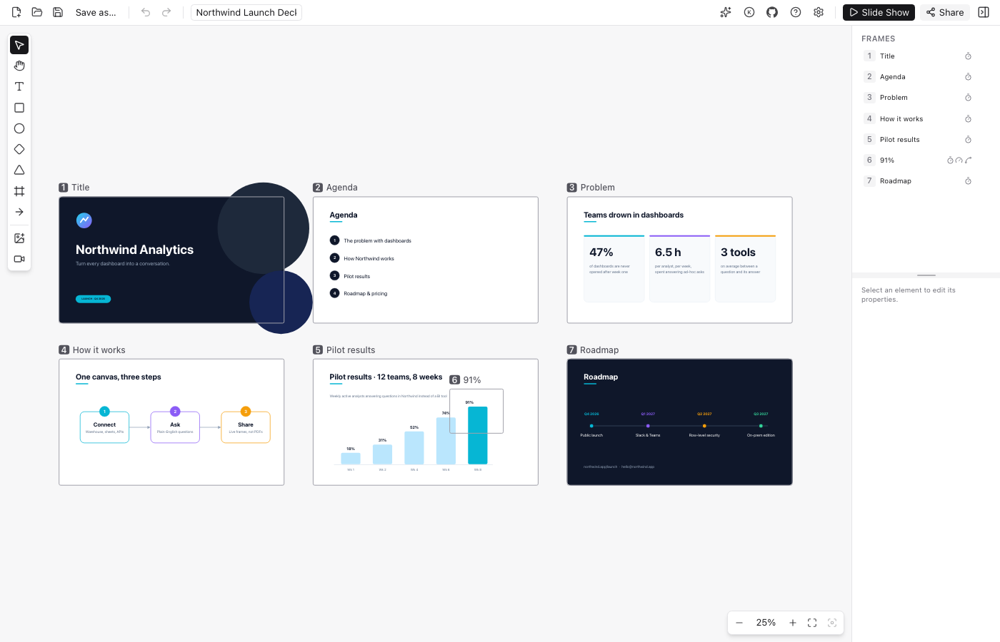

# CanvaSlide

**English** | [한국어](./README.ko.md)

An infinite-canvas presentation app for macOS and Windows. Arrange text, shapes and media on one
board, place **presentation frames** around the views you want to show, then press **Slide Show**
to move between them with continuous zoom/pan. Built with **Tauri 2 + React 19 + TypeScript**;
the editor also runs in a browser.



[Download releases](https://github.com/hwantage/CanvaSlide/releases) ·
[User guide](https://hwantage.github.io/CanvaSlide/docs/) ·
[Documentation map](./docs/README.md)

## Why CanvaSlide?

- **Present the big picture and the detail.** Arrange frames on one canvas and guide attention with
  continuous zoom/pan and per-frame camera motion.
- **Share one HTML file.** Export a presentation with a built-in player that opens in a browser.
- **Start with an AI prompt.** Choose General or Dynamic, then ask your assistant to create an editable
  presentation, optionally with HTML output.
- **Send a cloud snapshot.** Share an editable copy or a slideshow viewer with a link that lasts 24 hours.

## Features

- **Editing:** text, shapes, images and connectors; pan/zoom, multi-select, grouping, alignment,
  distribution, snapping, clipboard operations and undo/redo. Choose light/dark/system theme and English/Korean.
- **Presenting:** order and preview frames, move them with their contents, and edit transitions together.
  Set duration, easing, arc, roll and spotlight; navigate through the overview and play linked videos.
- **Import & export:** import images, PDF pages and [local Figma files](./docs/FIGMA-IMPORT.md);
  open/save editable JSON `.canvaslide` files. Export HTML with image quality controls and a size estimate;
  desktop export can embed installed fonts.
- **Sharing:** use a configured cloud service for editable copies or slideshow-only snapshots,
  or send an exported HTML file.

## Get started

1. Create content with the text or shape tools, paste an image, or import a file.
2. Draw frames with **F** and arrange their sequence in the frame list.
3. Start **Slide Show** with ⌘Enter / Ctrl+Enter. Use → and ← to navigate, **O** for overview,
   and **Esc** to return to the editor.
4. Save an editable `.canvaslide` with ⌘S / Ctrl+S, or export HTML with ⌘E / Ctrl+E.

Ready-made flowcharts, diagrams and presentations are in [examples](./examples/README.md).
Open one and start Slide Show to explore it.
For the full shortcut list, press **K** in the editor or visit the [shortcut guide](https://hwantage.github.io/CanvaSlide/docs/?guide=shortcuts).

## AI-assisted authoring

Open **Create with AI**, choose **General** or **Dynamic**, and copy the prompt into your AI assistant.
Enable **Generate an HTML file** when you want HTML alongside the editable document. The app prepares
and copies the prompt; generation happens in the assistant you choose. The optional portable
[CanvaSlide skill](./skills/README.md) and [authoring guide](./examples/README.md#authoring-with-ai)
cover the file schema, scene counts, nested frames and export validation.

## Files and sharing

Save an editable `.canvaslide` using the [current JSON format](./docs/ARCHITECTURE.md#document-formats), or export HTML with its own player.
Press **Copy link** to upload a cloud snapshot and share it for 24 hours.
See [cloud sharing](./docs/CLOUD-SHARE.md) for access options, limits and hosting setup.

## Develop and verify

Install Node.js 22.20+ and the pinned pnpm 11 version; Rust and the OS-specific Tauri prerequisites
are needed for desktop development. Full setup and checks are in [CONTRIBUTING](./CONTRIBUTING.md).

```bash
pnpm install
pnpm dev:web        # browser editor, http://127.0.0.1:1420
pnpm dev            # Tauri desktop window
pnpm check          # lint + max-lines + format + typecheck + unit tests
pnpm test:e2e       # Chromium suite + core interactions in Firefox/WebKit
```

For website development, use the [website guide](./website/README.md). For native bundle checks,
installer builds, signing and publishing, use the [release guide](./docs/RELEASE.md).

## Contributing

Bug reports, feature ideas and pull requests are welcome. See [CONTRIBUTING](./CONTRIBUTING.md)
for branch names, code rules and the PR checklist.

## License

[MIT](./LICENSE)
