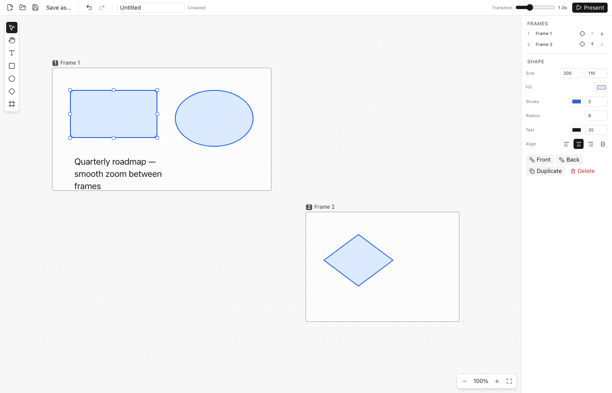
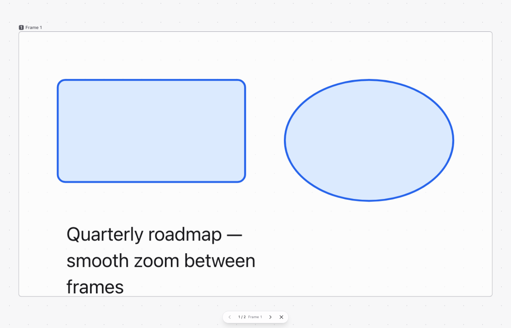

# CanvaSlide — 구현 결과 보고서

> 작성일: 2026-09-12 · 대상: v0.1.0 · PRD: [`docs/PRD.md`](./PRD.md)

## 1. 요약

PRD의 v1 목표(G1~G11)를 모두 구현했고, 정적 검사·단위 테스트·브라우저 E2E·Rust 테스트·macOS 네이티브
번들 빌드까지 통과했다. Electron 대신 **Tauri 2**를 채택했으며, 프로젝트 구조와 툴체인은 `orca` 저장소의
컨벤션(pnpm, oxlint/oxfmt, vitest, `config/` 분리, 파일당 max-lines, 도메인 중심 파일명)을 따른다.

| 검증 항목                                                       | 결과                                           |
| --------------------------------------------------------------- | ---------------------------------------------- |
| `pnpm lint` (oxlint + max-lines 가드)                           | 통과, 경고 0                                   |
| `pnpm format:check` (oxfmt)                                     | 통과                                           |
| `pnpm typecheck` (tsc strict, web/node/e2e)                     | 통과                                           |
| `pnpm test` (vitest, happy-dom)                                 | 29 파일 · 129 테스트 통과                      |
| `pnpm test:e2e` (Playwright, Chromium)                          | 42 시나리오 통과                               |
| `cargo fmt --check` / `cargo clippy -D warnings` / `cargo test` | 통과 · 4 테스트 통과                           |
| `pnpm tauri build --bundles app` (macOS arm64)                  | `CanvaSlide.app` 생성 (릴리즈, ~7 MB 바이너리) |

## 2. 구현 범위 대 PRD

| ID  | 요구사항                                                         | 상태 | 구현 위치                                                                   |
| --- | ---------------------------------------------------------------- | ---- | --------------------------------------------------------------------------- |
| G1  | 무한 팬/줌, 커서 기준 줌, 핀치, 휠 팬                            | 완료 | `shared/canvas/camera-transform.ts`, `hooks/use-wheel-zoom.ts`              |
| G2  | 선택/손/텍스트/사각형/타원/마름모/프레임 도구                    | 완료 | `store/tool-store.ts`, `lib/create-element-for-tool.ts`                     |
| G3  | 이동, 8방향 리사이즈, 다중 선택, 삭제, 복제, z-order             | 완료 | `lib/canvas-interaction-session.ts`, `shared/canvas/resize-handles.ts`      |
| G4  | 채우기/테두리/두께/모서리, 텍스트 색·크기·정렬·굵기, 프레임 이름 | 완료 | `components/panels/properties-panel.tsx`                                    |
| G5  | 이미지 paste, 2048px 다운스케일, 비율 유지 리사이즈              | 완료 | `hooks/use-image-paste.ts`, `lib/clipboard-image.ts`                        |
| G6  | 프레임 배치, 번호 표시, 순서 재정렬                              | 완료 | `shared/canvas/presentation-sequence.ts`, `panels/frame-list-panel.tsx`     |
| G7  | 슬라이드쇼 시작/이전/다음/종료, 연속 줌+팬                       | 완료 | `store/presentation-store.ts`, `shared/canvas/zoom-pan-interpolation.ts`    |
| G8  | 전환 시간 슬라이더(0~3s)                                         | 완료 | `panels/frame-transition-fields.tsx`(프레임별, 고급), `frame.transition.ms` |
| G9  | 새로 만들기/열기/저장/다른 이름으로 저장                         | 완료 | `platform/document-file-access.ts`, `src-tauri/src/document_io.rs`          |
| G10 | Undo/Redo (드래그·타이핑은 1스텝으로 병합)                       | 완료 | `store/document-store.ts`, `store/document-history.ts`                      |
| G11 | macOS/Windows 단축키 자동 매핑                                   | 완료 | `lib/platform-keys.ts`, `hooks/use-keyboard-shortcuts.ts`                   |

추가로 구현한 것: 프레젠테이션 **전체 보기(Overview)** 모드(하단 네비 맨 왼쪽 버튼 또는 `O` 키, 프레임 hover 강조·클릭 시 해당 프레임으로 점프),
프레임 이동 시 내부 요소 동반 이동, 프레젠테이션 중 전체화면 전환(Tauri)과 그리드·프레임
테두리 숨김, 빈 텍스트 요소 자동 삭제, 원자적 파일 쓰기(tmp → rename), 문서 스키마 zod 검증.

## 3. 아키텍처 하이라이트

### 3.1 순수 도메인 계층 (`src/shared/canvas`)

React·Tauri에 의존하지 않는 8개 모듈(총 ~900줄)이 카메라 수학, 보간, 피팅, 바운딩/히트테스트, 리사이즈,
문서 변환, 직렬화를 담당한다. 모든 모듈에 대응하는 `*.test.ts`가 있어 UI 없이 로직을 검증한다.

### 3.2 슬라이드쇼 전환

- 목표 카메라: 프레임 AABB를 뷰포트에 4% 여백으로 contain 피팅 (`frame-fit.ts`).
- 보간: van Wijk & Nuij(2003)의 최적 줌·팬 경로를 직접 구현 (`zoom-pan-interpolation.ts`).
  먼 프레임으로 갈 때는 자동으로 줌아웃→이동→줌인 궤적이 생기고, 가까우면 거의 직선이다.
- 설정의 **전환 시간(ms)** 은 문서 기본값이다. 시간이 고정이므로 먼 거리는 빠르게, 가까운 거리는 천천히
  움직이는 것처럼 느껴진다(PRD G8). 프레임마다 `transition`으로 전환 시간·가속 곡선·궤적·기울기·
  스포트라이트를 따로 둘 수 있고, 문서 기본값을 적용해 실제 값을 정하는 곳은 `resolveFrameTransition()`
  한 곳뿐이다(§3.15). 전환 도중 키 입력 시 현재 위치에서 새 목표로 재타게팅한다
  (`camera-animator.ts`, 큐잉 없음).

### 3.3 상태 관리

- 4개의 zustand 스토어(document/history, camera, tool, presentation)와 1개의 오버레이 스토어.
- 기록되는 편집은 `applyEdit`, 드래그/타이핑은 `beginEdit → 라이브 패치 → endEdit`로 하나의 undo 단위.
- 컴포넌트는 선택자로 필요한 슬라이스만 구독; 카메라 변경은 단일 CSS transform 갱신으로 처리한다.

### 3.4 플랫폼 경계

- `platform/document-file-access.ts`가 Tauri(네이티브 다이얼로그 + Rust IO)와 브라우저(dev:web, 다운로드/업로드)
  를 같은 API로 감싼다. 덕분에 Playwright E2E는 Rust 없이 브라우저에서 실행된다.
- Rust 쪽은 `read_document`/`write_document` 두 커맨드와 macOS 전용 메뉴만 가진다.
  기본 메뉴의 Undo/Redo 가속키가 ⌘Z를 가로채는 문제를 피하려고 메뉴를 직접 구성했다.

### 3.5 문서 포맷 v2와 HTML 익스포트

- **자산 중복 제거(포맷 v2)**: 이미지 데이터를 `document.assets`에 내용 해시(FNV-1a 64bit + 길이)로 한 번만 저장하고,
  이미지 요소는 `assetId`로 참조한다. 같은 이미지를 여러 번 붙여넣거나 복제해도 파일이 커지지 않으며,
  마지막 참조가 삭제되면 자산도 정리된다. v1 파일은 열 때 자동 마이그레이션된다(`document-assets.ts`).
- **단일 HTML 플레이어**: `src/player/`의 React 없는 바닐라 뷰어(약 11KB IIFE)가 `src/shared/canvas`의
  카메라·보간·피팅·순서 로직을 그대로 import하므로 앱과 동일하게 움직인다. Vite lib 빌드
  (`config/vite.player.config.ts`)로 번들한 뒤 앱이 `?raw`로 인라인한다. 외부 요청이 전혀 없는 오프라인 파일이다.
- **익스포트 다이얼로그(⌘E / Ctrl+E)**: 이미지 품질 3단계(원본 / 균형 1600px·0.85 / 작게 1200px·0.75),
  WebP 우선 재인코딩(미지원 엔진은 JPEG/PNG 폴백, 커지면 원본 유지), 저장 전 예상 파일 크기 표시.
  Tauri에서는 네이티브 저장 다이얼로그 + Rust `write_html_export`(원자적 쓰기), 브라우저에서는 다운로드.
- 플레이어 기능: ←/→/Space/Esc, 하단 네비, Overview(O) 모드에서 프레임 hover 강조·클릭 점프, 창 크기 변경 시 재피팅.

### 3.6 편집 기본기 (v1.2)

- **정렬/분배**: 2개 이상 선택 시 속성 패널에 좌/중/우·상/중/하 정렬, 3개 이상이면 가로/세로 균등 분배 버튼.
  순수 로직은 `element-alignment.ts`(바깥 두 요소 고정, 동일 간격).
- **객체 복사/붙여넣기**: ⌘C / ⌘X / ⌘V. 선택 요소와 참조 이미지 자산을 JSON 페이로드로 시스템 클립보드(텍스트)에
  쓰므로 다른 문서/창에도 붙여넣기 가능. 붙여넣을 때마다 24px씩 오프셋, 프레임은 순서를 뒤에 이어 붙인다.
  네이티브 `copy/cut/paste` 이벤트가 1차 경로이고, 편집 요소 포커스가 없어 `paste`가 오지 않는 엔진을 위해
  키다운 ⌘V 한 틱 뒤 메모리 폴백을 둔다(이중 붙여넣기 방지 직렬 번호).
- **드래그 복제**: ⌥(Alt) 드래그 또는 ⇧⌘ 드래그 시 선택을 복제한 뒤 복제본을 이동. 하나의 undo 단위.
- **프레임 목록**: 위/아래 화살표 대신 행을 드래그해 순서 변경(HTML5 DnD), 이름 더블클릭으로 인라인 수정.
  캔버스 위 프레임 제목(또는 테두리)을 더블클릭해도 그 자리에서 이름을 고칠 수 있다(Enter 확정, Esc 취소, undo 1단계).
- **상단 바**: `Present` → `Slide Show`, 내보내기 버튼을 그 오른쪽에 배치.

### 3.7 스마트 가이드 (드래그 스냅)

- 이동 중 선택 영역의 좌/중/우·상/중/하 선이 다른 요소의 선과 화면 기준 6px 이내면 스냅하고 빨간 가이드 선을 그린다.
- **동일 간격 스냅**: 교차축이 겹치는 이웃 쌍(a, b)의 간격 g를 기준으로 "b 뒤에 g만큼", "a 앞에 g만큼", "a와 b 사이 가운데"
  세 위치를 후보로 두고, 스냅되면 간격 구간 마커를 표시한다. 축별로 가장 가까운 후보를 택하고 같은 delta의 후보는 모두 가이드로 그린다.
- 이동은 프레스 원점 기준 절대 좌표로 적용해 드리프트가 없고, ⌘/Ctrl을 누른 채 드래그하면 스냅이 꺼진다.
  순수 로직은 `snap-guides.ts`(단위 테스트 6개).

### 3.8 설정 다이얼로그

- 상단 바의 전환 슬라이더를 톱니(설정) 버튼으로 대체(⌘, / Ctrl+,). 설정은 문서(`document.settings`)에 저장되어
  파일과 익스포트에 따라가며, 새 항목은 zod `.default()`로 추가해 기존 파일도 그대로 열린다.
- 현재 항목: 모양새(테마, 언어), 캔버스 배경(점/격자선/무지), 프레임(기본 전환 속도, 테두리), 업데이트.
  다이얼로그는 `<Section>` 단위로 구성되어 항목 추가가 쉽다.
- **슬라이드 쇼 절 삭제(v0.6)**: 가속 곡선·궤적·스포트라이트의 문서 기본값 UI를 들어냈다. 프레임별 카메라
  연출(3.15)이 같은 값을 프레임 단위로 다루면서, 같은 설정이 두 곳에 있고 한쪽이 다른 쪽의 "기본값"인 구조가
  되었다 — 저자는 어느 쪽을 만져야 하는지 매번 판단해야 했다. 셋의 필드 자체는 `document.settings`에 남아
  파일이 실어 오면 그대로 폴백으로 쓰이되 편집은 프레임 속성 한 곳에서만 한다. 다만 **기본 전환 속도**
  (`transitionMs`)는 프레임 절에 남겼다 — 덱 전체의 호흡은 프레임마다 고를 값이 아니라 덱의 성격이고,
  이 항목만은 원래부터 있던 설정이다.
- **언어**: 그 자리에 언어 설정(시스템/English/한국어)이 들어갔다. 지금까지 로케일은 시작할 때
  `navigator.language`로 한 번 정해졌고 바꿀 방법이 없었다. `language-store.ts`가 선택을 localStorage에
  저장하고 `setLocale()`과 `<html lang>`에 적용하며, `main.tsx`가 첫 렌더 전에 `syncLanguage()`로 복원한다.
  `t()`는 렌더 시점의 로케일을 읽으므로 `App`이 스토어를 구독해 트리 전체가 다시 그려진다.

### 3.9 연결선(커넥터)

- 새 요소 타입 `connector`: 양 끝점(`start`/`end`)은 항상 마지막으로 계산된 월드 좌표를 갖고, 호스트에 붙은 끝은
  `elementId` + `side`(top/right/bottom/left)를 추가로 가진다. 경로는 직선/꺾은선/곡선(3차 베지어), 화살표는
  없음/끝/양쪽, 스타일은 색·두께·점선, 가운데 라벨(더블클릭 편집).
- **기하 동기화**: `syncConnectorGeometry()`가 문서 스토어의 모든 변경 경로(recorded/applyLive/load)에서 실행되어
  붙은 끝점을 호스트의 현재 위치로 다시 계산하고 바운딩 박스(x/y/width/height)를 갱신한다. 덕분에 선택·박스 선택·
  프레임 포함·스냅 등 사각형 기반 기능이 그대로 동작한다. 호스트가 삭제되면 그 자리에 자유 끝점으로 남는다.
- **도구(L/C)**: 툴박스에 연결선 도구, 하위 플라이아웃에서 경로와 화살표 프리셋 선택. 도형 위에서 시작/끝을 놓으면
  가장 가까운 변의 연결 포인트로 스냅(4개 앵커 미리보기 표시). 4px 미만 클릭은 아무것도 남기지 않는다(`cancelEdit`).
- 선택된 커넥터는 리사이즈 박스 대신 양 끝 핸들을 보여 다시 연결/분리할 수 있다. 히트테스트는 선까지의 거리(6px)로 판정.
- 이동/복제/복사·붙여넣기/그룹 리사이즈에서 자유 끝점은 함께 이동하고 붙은 끝점은 호스트를 따른다. 복제·붙여넣기로
  호스트도 함께 복사되면 새 호스트에 다시 연결되고, 아니면 자유 끝점으로 전환된다. 정렬/분배 대상에서는 제외.
- **포트 선택(Miro 방식)**: 연결 포인트(변의 중점) 16px 이내에 놓으면 그 포트에 **고정**(`pinned`)되고, 도형 본체에
  놓으면 **자동** 포트가 된다. 자동 포트는 동기화 때마다 상대 끝(호스트 중심 또는 자유점)을 마주 보는 변으로 다시
  정해지고(`facingSide`), 고정 포트는 도형을 어디로 옮겨도 유지된다. 포트는 도형 외곽선에 있으므로 박스 밖 16px까지 호스트로 인식한다.
- **꺾은선 라우터**(`connector-routing.ts`): 앵커에서 24px 스터브로 직진한 뒤, 두 스터브 점 사이의 L자/ㄷ자 후보 4개를
  "출발 방향 유지 +2 / 역행 −3, 도착 방향 동일, 호스트 박스 관통 −4, 꺾임 수 −0.5"로 점수화해 최적 경로를 고른다.
  상하 배치에서 왼쪽 포트→오른쪽 포트는 "왼쪽으로 나가 → 내려가 → 오른쪽에서 진입"이 된다.
- 익스포트 플레이어도 같은 경로 함수로 렌더링한다. 인터랙션 세션은 파일 길이 한도에 맞춰 move/resize/connector로 분리.

### 3.10 편집 기본기 II (v1.3) — `discuss/todo/README.md`

반복 작업을 줄이고 배치를 정확히 하기 위한 14개 항목. 순수 로직은 `src/shared/canvas`에 두고 단위 테스트를 붙였다.

- **일반 텍스트 붙여넣기**: 외부 앱에서 복사한 텍스트를 ⌘V 하면 보이는 영역 가운데에 텍스트 요소를 만든다. CRLF 정규화·끝 줄바꿈 제거, 폭은 가장 긴 줄 기준으로 추정하되 화면의 60%를 넘지 않는다(`pasted-text.ts`). 텍스트 편집 중에는 `EditableText`가 `paste`를 가로채 서식 없는 텍스트만 삽입한다. 우선순위: 앱 객체 JSON → 이미지 → 일반 텍스트 → 메모리 폴백(`lib/external-content.ts`).
- **마지막 사용 스타일 기억**: 속성 패널에서 채우기·테두리·글자·연결선 스타일을 바꾸면 종류별로 기억(`style-memory.ts`, `store/style-memory-store.ts`)하고 새 도형/텍스트/연결선이 그 값에서 시작한다. 세션 범위.
- **선택 영역 확대**: ⇧2, 줌 컨트롤의 버튼, 우클릭 메뉴. 프레임 피팅과 같은 계산이지만 최대 400%까지만 확대(`fitSelectionToViewport`).
- **색상 입력 개선**: `ui/color-field.tsx` — 스와치+HEX 버튼을 누르면 팝오버에 네이티브 피커, HEX 직접 입력(`#abc`/`abc`/`#aabbcc` 허용), 채우기/테두리 ‘없음’(`fill="none"`), 최근 사용 색 8개(localStorage). 순수 로직 `color-input.ts`.
- **Shift 제약**: 도형/프레임을 그릴 때 정사각형·정원, 이동 시 이동량이 큰 축으로 고정(`drag-constraints.ts`). ⇧⌘ 드래그 복제는 그대로 동작한다.
- **우클릭 메뉴**: `canvas/context-menu.tsx`. 커서 아래 요소를 선택(다중 선택은 유지)한 뒤 편집·스타일·순서·프레임·확대·발표 항목을 단축키 라벨과 함께 보여준다. 뷰포트 밖으로 나가지 않도록 위치를 보정하고, 붙여넣기는 `navigator.clipboard.readText()` → 메모리 폴백. 진행 중인 제스처가 있으면 무시한다(macOS Ctrl+클릭이 `contextmenu`를 함께 내기 때문).
- **선택한 객체로 프레임 만들기**: ⌘⇧F, 속성 패널 버튼, 메뉴. 선택 영역에 48px 여백을 더한 프레임을 만들고 선택한다(`frame-from-selection.ts`, `lib/selection-commands.ts`).
- **이미지 파일 끌어놓기**: 뷰포트 `dragover/drop`에서 PNG/JPEG를 받아 떨어뜨린 지점을 중심으로 배치(여러 장이면 계단식). `tauri.conf.json`의 `dragDropEnabled: false` 덕분에 WebView에서도 HTML5 드롭이 그대로 온다.
- **작은 작업**: Enter → 선택한 텍스트·도형·연결선 편집, F2 → 프레임 이름 변경, ⌘] / ⌘[ 한 단계 앞/뒤(맨 앞/뒤는 ⌘⇧] / ⌘⇧[; `reorderZ`의 `forward`/`backward`는 선택 묶음의 상대 순서를 유지), ⌘⇧⏎ 또는 프레임 행의 ▶로 선택한 프레임(또는 선택을 완전히 포함한 프레임)부터 발표, ⌥⌘C / ⌥⌘V 스타일 복사·붙여넣기(`style-clipboard.ts`, 내용·위치는 유지), 상단 바 `?` 버튼과 `?` 키로 플랫폼별 단축키 도움말.
- 단축키 처리는 `lib/primary-shortcuts.ts`(⌘/Ctrl 조합)와 `lib/plain-shortcuts.ts`(단일 키)로 분리했고, macOS에서 ⌥가 글자를 바꾸는 조합은 `event.code`로 판별한다.

### 3.11 PDF 가져오기

- 왼쪽 툴바의 **이미지·PDF 가져오기** 버튼(⌘I / Ctrl+I, 우클릭 메뉴에도 있음)이 파일 선택 창을 열며, 숨김 `<input type="file">`을 쓰므로 브라우저와 Tauri WebView에서 같은 코드가 돈다(`lib/file-picker.ts`). 캔버스에 PDF를 끌어놓거나 붙여넣으면 [pdf.js](https://mozilla.github.io/pdf.js/)로 각 페이지를 1600px 폭(최대 변 2048px)의 JPEG로 렌더링해 이미지 요소로 넣고, 페이지마다 같은 크기의 프레임을 만들어 바로 발표할 수 있게 한다(`lib/pdf-import.ts`). 프레임 이름은 `파일명 n`, 전체가 undo 1단계(`insertImported`), 생성된 프레임이 선택된다.
- 배치는 순수 로직 `pdf-page-layout.ts`: 페이지 폭 960(기본 프레임 폭), 간격 80, 열 수 `ceil(√n)`의 격자, 행 높이는 그 행의 가장 큰 페이지 기준. 드롭 지점이 격자의 좌상단이다.
- pdf.js 런타임 파일(워커, 표준 글꼴 14종, 이미지 디코더 wasm)은 `pnpm build:pdfjs`(`config/scripts/copy-pdfjs-assets.mjs`)가 `src/renderer/public/pdfjs/`로 복사하며 gitignore 대상이다. `dev:web`/`build:web` 앞에 자동 실행된다. Tauri CSP에 `script-src 'self' 'wasm-unsafe-eval'`을 추가해 wasm 디코더를 허용했고, 라이브러리는 첫 사용 시 지연 로드한다.
- 제약: 텍스트는 편집할 수 없는 그림이 되고, 암호가 걸린 PDF는 거부한다. 이미지가 data URL로 문서에 인라인되므로 30페이지 덱이면 문서가 수 MB가 된다.

### 3.12 앱 업데이트 확인·설치

- `tauri-plugin-updater` + `plugin-process`(재시작) + `plugin-opener`(릴리즈 페이지 열기). 설정 다이얼로그의 **업데이트** 절(`panels/update-section.tsx`)에서 현재 버전, 확인, 설치/다운로드 페이지 버튼, "시작할 때 확인" 스위치(localStorage)를 제공하고, 새 버전이 있으면 상단 바 설정 버튼에 점 배지가 붙는다.
- 플랫폼 분기는 `platform/app-update.ts` 한 곳에 있다. Windows 데스크톱만 앱 내 설치(`downloadAndInstall` → `relaunch`), macOS는 서명 전이라 릴리즈 페이지로 안내, 브라우저는 `latest.json`을 직접 읽어 `isNewerVersion()`(`shared/canvas/app-version.ts`)으로 비교한다. 현재 버전은 Vite `define`으로 `package.json`에서 주입한다.
- 시작 3초 뒤 자동 확인(데스크톱만), macOS 메뉴 **Check for Updates…**는 `check-updates-requested` 이벤트로 설정 다이얼로그를 열고 확인을 실행한다. 서명 키·피드 구성은 `docs/RELEASE.md` §7.

### 3.13 글꼴 선택

- `textStyle.fontFamily`(선택 필드, 없으면 기본 산세리프)에는 기본 제공 id(`sans`/`serif`/`mono`/`rounded`/`display`, 두 플랫폼 공통 스택으로 풀림) 또는 **설치된 글꼴 이름**을 저장한다. 설치 글꼴은 `"이름", <산세리프 스택>`으로 렌더링되어 그 글꼴이 없는 기기에서는 산세리프로 대체된다(`font-family.ts`).
- 설치 글꼴 목록은 Rust 명령 `list_system_fonts`(`font-kit`: macOS CoreText·Windows DirectWrite·Linux fontconfig)가 준다. 브라우저에서는 Local Font Access API가 있고 허용된 경우에만 목록이 나오고, 아니면 기본 제공 항목만 보인다(`platform/system-fonts.ts`, 세션당 1회 로드 `store/font-store.ts`).
- **내보내기 글꼴 임베딩**: 내보내기 다이얼로그의 "이 문서에 쓰인 설치 글꼴 n개 포함"(기본 켜짐, 데스크톱만)을 켜면 `collectFontUsage()`가 설치 글꼴별·굵기별로 쓰인 글자를 모으고, Rust 명령 `subset_fonts`(`allsorts`)가 그 글자만 남긴 서브셋을 만들어(`.notdef` 포함, Unicode cmap, CFF는 `opentype`) base64 `@font-face`로 HTML `<head>`에 넣는다(`font-embedding.ts`). 찾지 못한 글꼴은 건너뛰어 대체 글꼴로 남고, 굵은 얼굴이 없으면 찾은 얼굴의 실제 굵기를 선언해 브라우저가 합성한다. 예상 크기 옆에 포함된 글꼴 수와 용량을 표시하고, 라이선스 확인 안내를 함께 둔다.
- 속성 패널의 **글꼴** 선택기(`ui/font-picker.tsx`)는 검색 입력, 기본 제공 절, 설치된 글꼴 절(각 항목을 해당 글꼴로 렌더링)로 구성되며 텍스트·도형 라벨·연결선 라벨에 공통 적용되고, 마지막 사용 스타일·스타일 복사에도 따라간다. 기존 문서는 필드가 없으면 기본 글꼴로 열린다.

### 3.14 그룹·그룹 해제

- **모델**: 요소의 `groupId`(선택 필드)만으로 표현하는 평면 그룹(Miro 방식, 중첩 없음). 프레임은 그룹에 들어가지 않는다(프레임은 이미 내용물을 함께 옮긴다). 순수 로직 `element-groups.ts`: 그룹 확장·생성(기존 그룹은 병합, 멤버를 z-order상 연속되게 재배치)·해제·복제 시 새 그룹 id 부여.
- **선택 규칙**: 클릭·박스 선택은 그룹 전체를 선택하고, ⌘/Ctrl+클릭은 그룹 안의 한 요소만 고른다(Figma의 깊은 선택). ⇧클릭은 그룹 단위로 토글. 이동·크기 조절·삭제·정렬은 선택 집합에 그대로 작동하므로 별도 처리가 없다. 더블클릭은 그룹 안 요소의 텍스트 편집을 연다.
- **명령**: ⌘G 그룹, ⌘⇧G 해제. 속성 패널(제목이 "그룹 · 요소 n개"로 바뀜), 우클릭 메뉴, 단축키 도움말. 복제·복사/붙여넣기는 그룹 관계를 새 id로 유지한다.

### 3.15 프레임별 카메라 연출

- **문제**: 카메라 이동이 제품의 핵심인데 표현 파라미터가 `settings.transitionMs` 하나뿐이고 그마저 문서 전역이라,
  프레임을 어떻게 배치해도 전환이 모두 "같은 상수의 같은 함수"가 되어 긴 덱이 단조로웠다.
- **프레임 속성 `transition`**(전부 선택 필드, 미설정 시 문서 설정으로 폴백): `ms`, `easing`, `arc`(van Wijk ρ),
  `roll`, `spotlight`. 문서 설정의 `transitionMs`·`transitionEasing`·`transitionArc`·`spotlight`는 폴백으로만
  남아 파일이 실어 온 값을 그대로 쓰되 설정 다이얼로그에서는 편집하지 않는다(3.8). 모든 신규 필드가
  optional·`.default()`라 기존 파일은 그대로 열리고 동일하게 재생된다.
- **ρ 노출**: `createZoomPanInterpolator`는 이미 `rho` 인자를 받고 있었으나 `createCameraTween`이 넘기지 않아
  √2로 고정돼 있었다. 배선만으로 새 표현 축이 열린다 — 타이트→타이트 6000유닛 이동에서 ρ 1.0은 최대 시야폭
  3115, ρ 2.4는 17300으로 같은 출발·도착·시간에 전혀 다른 샷이 된다(`camera-easing.ts`, 5종 프리셋).
- **롤**: `Camera`는 `{x, y, zoom}` 그대로 두고, 프레젠테이션 중에만 월드를 감싸는 스테이지에 `rotate()`를
  적용한다. 편집·히트테스트·스냅은 회전을 전혀 보지 않는다. 기울어진 프레임이 뷰포트를 벗어나지 않도록
  `rolledSpan()`이 회전 후 화면축 폭·높이를 계산해 `fitRectToViewport`가 그만큼 더 축소한다.
  종료(Esc)는 롤과 디밍을 한 번에 떨어뜨린다 — 복귀 비행 내내 기울고 어두운 편집기가 보이는 편이 더 나쁘다.
- **스포트라이트**: 스테이지 안의 SVG 한 장이 even-odd로 프레임을 뚫어 바깥을 어둡게 한다. 롤과 함께 회전한다.
  구멍은 프레임 id가 아니라 **월드 좌표 사각형**(`spotlightRect`)으로 들고 다니며, 전환 중에는 출발 프레임에서
  도착 프레임으로 `interpolateRect()`로 이동한다. 처음에는 비행 시작과 함께 id를 목적지로 바꿨는데, 50% →
  0%처럼 밝아지는 전환에서 구멍이 먼저 사라져 화면 전체가 캄캄해졌다가 밝아졌다. 플레이어도 같은 방식이다.
- **단계 프리셋**: ρ 1.41이나 `roll: -22`는 저자가 결정할 수 있는 단위가 아니다. 속성 패널은 다섯 항목을
  한 줄에 하나씩, 이름 붙은 단계를 고르는 선택 상자로 제시한다(전환 시간 빠르게·보통·느리게, 궤적
  직선·기본·크게, 기울기 왼쪽/오른쪽 × 조금(5°)·중간(15°)·많이(30°), 스포트라이트 없음·약(20%)·중(50%)·
  강(100%)). 숫자 슬라이더는 **고급**에서만, 선택 상자를 대신해 같은 자리에 나온다. 슬라이더의 범위는 끌 만한
  구간(±45°, 3초)이되 스키마가 허용하는 값(±180°, 10초)을 실어 온 문서에서는 그 값에 맞춰 늘어난다 — 아니면
  슬라이더를 건드리는 순간 브라우저가 값을 조용히 깎는다. 버튼 묶음을 먼저 썼다가
  선택 상자로 바꿨다 — 256px 패널에서 4개짜리 묶음은 글자가 잘리고, 다섯 줄이 모두 버튼이면 무엇을 고르는
  화면인지가 아니라 버튼 개수가 먼저 보인다.
- **기울기의 방향**: 세기 4단계 + 좌우 뒤집기 버튼이었으나, 뒤집기 버튼은 눌러야만 지금 어느 쪽인지 알 수
  있었다. 지금은 왼쪽 많이 … 없음 … 오른쪽 많이의 한 줄짜리 척도이고, 닫힌 선택 상자가 현재 방향을 그대로
  말한다.
- **재정의는 "다르다"는 뜻만**: 모든 편집이 `pruneFrameTransition()`을 지나며 문서 기본값과 같아진 필드는
  아예 저장하지 않는다. 다른 단계를 골랐다가 원래 단계로 돌아온 프레임에 점이 남으면, 그 점과 프레임 목록
  표식(해석 후 값을 비교한다)이 서로 다른 말을 하게 된다. 그래서 기울기 "없음"은 문서에 기울기 기본값이
  없으므로 저절로 지워지고, 스포트라이트 "없음"은 문서가 어둡게 할 때만 재정의로 남는다.
- **초기화는 절 단위**: 항목마다 되돌리기 버튼을 두었더니 다섯 줄이 모두 두 개의 컨트롤을 갖게 됐다. 지금은
  절 머리의 되돌리기 아이콘 하나가 `transition`을 통째로 지운다.
- **전환 미리보기 모드**: 절 제목 옆 재생 버튼이 `previewTransition(frameId)`를 호출한다(순서 인덱스가 아니라
  **프레임 id**로 든다 — 미리보기가 멈춰 있는 동안에도 목록에서 덱을 재정렬할 수 있기 때문이다). 직전 프레임의
  카메라·롤·디밍으로 건너뛰고 **0.5초 머문 뒤**(`PREVIEW_DEPARTURE_HOLD_MS`) 이 프레임으로 들어오는
  비행을 재생하며, **착륙한 자리에 머문다**. 첫 프레임은 직전 프레임이 없어 출발 대기가 없다.
  오른쪽 위 알약에 다시 재생·닫기가 있고 Esc로도 닫힌다. 대기는 애니메이터의 `holdMs` 옵션으로 처리해
  준비·대기·이동을 함께 취소한다. 준비 중에는 원래 카메라와 롤·디밍을 유지하고, 준비 후 출발 화면으로 컷한다.
  출발 컷이 그려질 기회를 두 번의 rAF로 확보한 뒤 0.5초를 계산한다. 0초 전환도 준비 완료 시점의 샷을
  적용하므로 첫 프레임을 미리볼 때 이전 롤·디밍이 남지 않는다.
  대기 중에도 `animationActive`를 유지하므로 곧 떠날 화면의 상세 타일 작업을 새로 시작하지 않는다.
  미리보기와 슬라이드 쇼는 같은 `prepareCameraFlight()`를 사용한다. 출발·도착 상세 타일을 미리 모두 만드는
  별도 경로는 시작 지연을 늘려 사용하지 않는다. 이미 표시한 상세 타일이 비행 목적지의 카메라·뷰포트·DPR와
  일치할 때만 숨겨 보관해 재사용한다. 다른 목적지의 타일은 출발 전에 버려 정지 배율 재배치 비용을 줄인다.
  미리보기 시작은 편집기 크롬의 크기를 바꾸지 않으므로 뷰포트를 다시 측정하지 않는다.
  준비·출발 대기는 정지 카메라 배율로 레이아웃하고, 이동은 기존 CSS zoom 1 경로를 쓴다. 착륙 때는
  정지 감지 타이머를 더 기다리지 않고 즉시 정지 배율로 복원한다. 네이티브 일반 창에서는 작은 SVG 이미지가
  낮은 해상도로 합성돼 이동 중 흐려질 수 있다. `imageLayoutScale()`은 비행의 출발·도착 최대 배율에 필요한
  SVG 레이아웃 크기를 확보하고 역방향 transform으로 원래 월드 크기를 유지한다. 이 확대와 즉시 착륙 배율 복원은
  CAMERA 미리보기에만 적용한다. 일반 편집·슬라이드 쇼에 적용하면 준비·재배치 비용이 늘어나므로 기존 경로를 유지한다.
  추가 확대는 2048px 변 길이로 제한하며 PNG·JPEG에는 적용하지 않는다. 전체 화면에서 선명했던 슬라이드 쇼도 일반 창으로 바꾸면 같은 문제가
  재현되므로, 검증 때 DOM 타일 개수와 헤드리스 캡처뿐 아니라 실제 Tauri 창의 이동 장면을 확인해야 한다.
  처음에는 착륙과 동시에 편집기로 돌아가게 만들었는데, 한 번 보고 값을 고치려면 매번 다시 눌러야 했고 0.5초
  뒤에는 무엇을 봤는지 비교할 대상이 사라졌다. 지금은 **미리보기 중에도 편집기 크롬이 그대로 있다** — 조정할
  대상이 오른쪽 속성 패널이므로 그것까지 감추면 모드 자체가 쓸모없다. 그래서 크롬을 접는 조건은 `active`가
  아니라 `selectSlideShowActive`(= `active && previewFrameId === null`)이고, 캔버스 조작 차단·그리드 숨김·롤·디밍은
  `active` 그대로다(기울어진 화면에서 히트테스트가 어긋나면 안 된다). 키보드도 미리보기 중에는 Esc만 가져간다.
  전체화면 전환은 하지 않고, 다시 재생은 `cameraBeforeStart`를 덮어쓰지 않는다.
  id로 든다는 말은 **카메라를 다시 움직이는 모든 경로**에 적용된다: `settle()`과 `refitToViewport()`도
  `presentedIndex()`로 그 id의 현재 자리를 다시 물어본다. 처음에는 출발 시점의 숫자 인덱스를 그대로 들고
  있었는데, 미리보기가 멈춰 있는 동안 목록에서 재정렬하면 창 크기가 바뀌는 순간 **엉뚱한 프레임으로**
  날아갔다. 미리보기 중에는 Esc만 예약되므로 Delete는 편집기로 그대로 내려가 보던 프레임이 지워질 수도
  있다 — 그때는 자리를 물려받은 프레임에 다시 맞추는 대신 `cancelPreview()`로 카메라를 놓는다.
- **재정의 표시는 컨트롤에**: 라벨 왼쪽에 점을 찍었더니 그 줄만 다른 속성 행보다 들여쓰기가 밀렸다. 지금은
  다섯 줄 모두 다른 속성과 같은 `FieldRow`를 쓰고(같은 활자·여백·컨트롤 폭 `w-36`), 재정의된 항목은 컨트롤
  자체가 `border-primary`를 입는다(슬라이더 모드에서는 수치 읽기가 강조된다). 표시가 값 옆에 있으니 어느
  값이 덱과 다른지 눈이 한 번만 움직인다.
- **고급은 교체이지 추가가 아니다**: 처음에는 선택 상자 아래에 슬라이더를 덧붙였는데, 한 값에 컨트롤이 두 개면
  어느 쪽이 지금 값인지 매번 대조해야 한다. 지금은 같은 열에서 선택 상자가 슬라이더로 바뀐다(가속 곡선은
  숫자 축이 없으므로 그대로 선택 상자). 두 컨트롤이 같은 폭·같은 높이(`h-7 w-36`)를 강제하므로 고급을
  여닫아도 행이 움직이지 않는다 — 펼칠 때마다 아래 버튼들이 들썩이면 무엇이 바뀌었는지 읽을 수 없다.
- **슬라이더 한 번 끌기 = 되돌리기 한 칸**: 슬라이더는 지나가는 눈금마다 `change`를 쏘므로 그때마다 기록하면
  문서 스냅샷이 수십 개 쌓인다. 되돌리기 횟수보다 나쁜 것은 히스토리 상한(`HISTORY_LIMIT` 100)이라 한 번
  끌면 **그 앞의 진짜 편집들이 밀려난다**. 드래그·타이핑과 같은 규약을 쓴다(`beginEdit` →
  기록하지 않는 패치 → `endEdit`). 포인터는 입력 바깥에서 놓이는 일이 많아 release는 window에서 듣고,
  끌던 중에 언마운트되는 경우(고급을 접거나 설정을 닫거나)도 정리 단계에서 세션을 닫는다. 단계 선택 상자는
  이산값이라 지금처럼 한 번에 하나씩 기록한다.
  앱의 `type="range"`는 두 개뿐이고(프레임 카메라, 설정의 기본 전환 속도) 둘 다
  `use-slider-edit-session.ts` 한 훅을 쓴다. 설정 쪽은 문서 설정을 바꾸므로 `updateSettings`도
  `patchElements`와 같은 `record` 인자를 받는다.
- **다시 재생이 끊기던 이유**: 첫 재생은 매끄러운데 다시 재생만 뚝뚝 끊겼다. 원인은 미리보기가 아니라
  `useSettledZoom`이었다 — 카메라가 멈춰 있는 동안 월드를 도착 배율로 다시 레이아웃해 선명하게 만들고,
  다음 비행이 시작되는 순간 다시 배율 1로 되돌린다. 그 리플로가 비행 **첫 프레임들과 정확히 겹친다**.
  첫 재생은 편집기가 이미 배율 1이라 되돌릴 것이 없어서 매끄러웠던 것이다(작은 프레임 120개 텍스트 문서에서
  1초 비행의 갱신 프레임이 60 → 51로 줄고 프레임당 이동량 중앙값이 52px → 120px로 튀었다).
  고침은 비행 준비 단계에 있다: `prepareCameraFlight()`(옛 `camera-image-preparation`)가 SVG 래스터 리스에
  더해 **항상 한 번의 페인트를 기다린다**. 애니메이터는 `prepare()` 전에 이미 `animationActive`를 켜므로,
  레이아웃 전환이 그려진 뒤에 트윈이 출발한다. 같은 측정에서 다시 재생도 60프레임·중앙값 48px로 돌아왔다.
- **단계 밖의 값**: 슬라이더나 생성된 파일이 준 중간값은 가장 가까운 단계로 스냅하지 않고 `22°` 항목을
  임시로 만들어 그 값 그대로 보여준다. 가까운 단계를 칠해 두면 "이미 눌린" 항목을 고르는 순간 값이 몰래
  바뀐다.
- **프레임 목록 표식**: 처음에는 전환의 체감 속도(van Wijk S ÷ 전환 초)를 막대로 그렸는데, 그 막대는 덱 전체
  최댓값에 대한 상대값이라 한 행만 봐서는 읽을 수 없었다. 목록이 답해야 할 질문은 그보다 단순하다 —
  "이 프레임은 기본값 그대로인가". 지금은 `frameMotionDiff()`가 **해석 후** 값을 문서 기본값과 비교해 실제로
  달라지는 항목만 돌려주고, 행에는 그 항목의 아이콘만 찍힌다. 재정의 키의 유무가 아니라 결과를 비교하므로
  기본값과 같은 값을 못 박은 프레임은 표시되지 않는다. 대부분의 행이 비어 있는 것이 신호다.
- **애니메이터**: `animateTo(target, ms, options)`로 바뀌어 `rho`·`easing`·`onProgress`를 받는다. `onProgress`는
  이징이 적용된 진행도를 넘기므로 롤·디밍이 카메라와 정확히 같은 시계로 움직인다.
- **프레임 속성 정리**: 프레임만 선택했을 때 z-order 버튼 4개와 "선택 영역을 프레임으로"를 감춘다.
  프레임은 항상 내용물 아래에 그려지므로 z-order는 겹친 프레임끼리의 선택 순서 말고는 눈에 보이는 변화가 없고,
  프레임을 프레임으로 감싸는 것은 발표 순서에 중복 슬라이드를 조용히 추가하는 동작이었다. 둘 다 UI가 아니라
  **명령이** 거부한다 — 감싸기는 `frameSelection()`이, z-order는 순수 변환 `reorderZ()`가 프레임만 있는 선택을
  그대로 돌려보낸다. 그래서 ⇧F는 물론 `]`·`[` 단축키로도 보이지 않는 편집과 빈 undo 항목이 생기지 않는다.
  판정은 `shared/canvas`의 `selectionIsOnlyFrames()` 한 곳이다.
- 플레이어(`src/player/`)도 같은 `src/shared/canvas`를 쓰므로 HTML 익스포트에서 동일하게 동작한다.

## 4. 리뷰 중 발견·수정한 결함

| #   | 증상                                                                                                            | 원인                                                                                                                                         | 수정                                                                                                                                                                                                                                                                                                                                                                                                      |
| --- | --------------------------------------------------------------------------------------------------------------- | -------------------------------------------------------------------------------------------------------------------------------------------- | --------------------------------------------------------------------------------------------------------------------------------------------------------------------------------------------------------------------------------------------------------------------------------------------------------------------------------------------------------------------------------------------------------- |
| 1   | 붙여넣은 이미지 폭이 0px                                                                                        | Tailwind preflight의 `img { max-width: 100% }`가 폭 0인 월드 레이어 기준으로 적용                                                            | `max-w-none` 지정 (E2E로 재발 방지)                                                                                                                                                                                                                                                                                                                                                                       |
| 2   | Windows에서 Ctrl+Shift+Z 무반응                                                                                 | redo를 Ctrl+Y로만 매핑                                                                                                                       | 두 조합 모두 허용                                                                                                                                                                                                                                                                                                                                                                                         |
| 3   | 새 텍스트 요소가 생성 직후 사라짐                                                                               | StrictMode의 effect 이중 실행 시 cleanup이 "편집 종료"로 오인되어 빈 텍스트 삭제                                                             | true→false 전이만 감지하도록 ref 기반으로 변경                                                                                                                                                                                                                                                                                                                                                            |
| 4   | 프레젠테이션 첫 프레임이 살짝 어긋남                                                                            | 크롬(툴바/패널)이 사라지기 전 뷰포트 크기로 카메라 계산                                                                                      | `useLayoutEffect`에서 재측정 후 `flyToCurrent()` 호출                                                                                                                                                                                                                                                                                                                                                     |
| 5   | 다크 모드에서 기본 텍스트(#18181b)가 안 보임                                                                    | 캔버스 배경도 다크로 전환                                                                                                                    | 캔버스는 항상 밝은 "종이"로 고정, 크롬만 테마 추종                                                                                                                                                                                                                                                                                                                                                        |
| 6   | 편집 중 텍스트 드래그 선택이 불안정할 가능성                                                                    | 포인터 캡처가 contentEditable 클릭에도 적용                                                                                                  | 편집 대상 내부 클릭은 캡처하지 않음                                                                                                                                                                                                                                                                                                                                                                       |
| 7   | 프레임을 옮겨도 내용이 남음                                                                                     | 이동 대상이 선택 항목만                                                                                                                      | 선택된 프레임에 완전히 포함된 요소를 이동 집합에 합류                                                                                                                                                                                                                                                                                                                                                     |
| 8   | 도형 생성 시 점선 미리보기가 항상 좌상단에 표시                                                                 | 오버레이 style에 `{x, y}`를 넘겨 `left/top`이 미적용                                                                                         | `rectToCssPosition()`으로 변환, E2E 추가                                                                                                                                                                                                                                                                                                                                                                  |
| 9   | 확대 시 글자·도형이 비트맵처럼 깨짐                                                                             | 월드 레이어를 `transform: scale()` + `will-change`로 합성해 100% 래스터를 확대                                                               | 팬은 `translate`, 배율은 CSS `zoom`으로 분리해 실제 배율로 재레이아웃(벡터 유지). 스트로크도 배율에 비례                                                                                                                                                                                                                                                                                                  |
| 10  | 다중 선택 후 이동하려 하면 선택이 풀림                                                                          | 객체 사이 빈 공간을 잡으면 히트테스트가 null → 빈 캔버스 클릭으로 처리되어 선택 해제                                                         | 선택 영역(bounds) 안쪽 press는 그룹 이동으로 처리, 클릭만 하면 해제. E2E 추가                                                                                                                                                                                                                                                                                                                             |
| 11  | 프레임 제목이 다른 객체에 가려지면 캔버스에서 선택 불가                                                         | 프레임 히트테스트가 제목 띠에서만 성립                                                                                                       | 프레임 외곽선 ±4px(화면 기준) 띠도 히트 영역에 포함. 겹친 콘텐츠는 여전히 우선                                                                                                                                                                                                                                                                                                                            |
| 12  | 슬라이드쇼 하단 이전/다음 버튼이 동작하지 않음                                                                  | 뷰포트가 pointerdown에서 포인터를 캡처해 click이 버튼 대신 뷰포트로 전달                                                                     | `data-canvas-ui` 영역에서 시작한 포인터는 캡처하지 않음. E2E 추가                                                                                                                                                                                                                                                                                                                                         |
| 13  | 익스포트 플레이어의 Overview에서 도형이 프레임 클릭을 가로챔                                                    | 플레이어 콘텐츠 레이어에 `pointer-events: none` 누락                                                                                         | 앱과 동일하게 콘텐츠는 포인터를 받지 않도록 수정. E2E에서 검출                                                                                                                                                                                                                                                                                                                                            |
| 14  | 슬라이드쇼 시작 시 첫 프레임이 화면에 꽉 차지 않고 옆 프레임까지 보임                                           | macOS 전체화면 전환이 비동기라 창이 커지기 전 뷰포트로 카메라를 계산                                                                         | 프레젠테이션 중 뷰포트 크기 변화(ResizeObserver, 60ms 디바운스) 시 현재 프레임/Overview에 재피팅                                                                                                                                                                                                                                                                                                          |
| 15  | 데스크톱 앱에서 화면 캡처 후 ⌘V 해도 이미지가 붙지 않음                                                         | WKWebView는 편집 요소에 포커스가 없으면 DOM `paste` 이벤트를 주지 않거나 데이터를 비워서 줌                                                  | `tauri-plugin-clipboard-manager`로 OS 클립보드(이미지→PNG, 텍스트)를 직접 읽는 폴백. ⌘V 뒤 이벤트가 없거나 비어 있을 때와 우클릭 붙여넣기에 사용(`platform/native-clipboard.ts`)                                                                                                                                                                                                                          |
| 16  | 객체보다 작은 프레임은 번호·테두리가 가려지고 선택도 안 됨                                                      | 프레임 크롬이 콘텐츠 아래에 그려지고 히트테스트도 콘텐츠 우선                                                                                | 제목 띠(z-index 2)와 외곽선(z-index 1)만 콘텐츠 위로 올리고 채움은 아래 유지. 제목 띠 클릭은 항상 프레임, 외곽선 띠는 콘텐츠에 가려지지 않은 곳만. E2E 추가                                                                                                                                                                                                                                               |
| 17  | ⌘/Ctrl+클릭으로 다중 선택이 안 되고, 프레임 안쪽 빈 곳을 ⇧클릭해도 프레임이 추가되지 않음                       | 추가 선택이 ⇧에만 매핑되고, 프레임은 크롬에서만 히트                                                                                         | ⇧ 또는 ⌘/Ctrl 클릭 모두 토글로 처리하고, 수정키를 누른 채 프레임 내부 빈 곳을 클릭하면 그 프레임을 토글. 박스 선택도 같은 수정키로 추가 선택. E2E 추가                                                                                                                                                                                                                                                    |
| 18  | 슬라이드쇼 시작 직후 첫 프레임이 화면에 맞지 않는 문제 재발 보고 (macOS 전체화면)                               | 전체화면 전환 완료 시점이 환경마다 달라 비행 종료 후 뷰포트가 바뀌어도 재피팅 이벤트를 놓칠 수 있음                                          | 비행이 끝날 때 현재 뷰포트 기준 목표와 0.5px 이상 어긋나면 250ms로 스스로 보정(`settle`), `setFullscreen` 완료 후에도 재피팅. 비행 중 뷰포트를 바꾸는 E2E 추가                                                                                                                                                                                                                                            |
| 19  | 빈 공간을 보던 상태로 저장한 파일을 열면 빈 캔버스처럼 보임                                                     | 열 때 저장된 카메라를 그대로 복원                                                                                                            | 열 때는 항상 내용 전체가 보이도록 맞춤(100% 초과 확대 없음, 빈 문서는 원점). `cameraForOpenedDocument()`. 카메라는 여전히 저장하지만 열 때 쓰지 않음. E2E 추가                                                                                                                                                                                                                                            |
| 20  | 프레임 목록이 스크롤될 때 행을 위로 끌어 올릴 수 없고, 놓을 위치가 행 전체로 강조되어 "안으로" 넣는 것처럼 보임 | HTML5 드래그는 작은 스크롤 영역을 자동 스크롤하지 않고, 드롭 대상을 행 단위로 표시                                                           | 드래그 중 문서 전체의 `dragover`로 커서를 추적해 영역 위·아래 40px 안에 있으면 매 프레임 근접도에 비례해 연속 스크롤(`hooks/use-drag-auto-scroll.ts`), 드롭 위치는 모든 행의 중점과 비교해 간격(0..n)으로 계산해 삽입선으로 표시(`list-drop-gap.ts`, `gapToIndex`, `moveFrameToGap`). 끌던 행 주변 간격은 표시하지 않음. 오른쪽 패널은 프레임/속성 분할과 드래그 조절(`side-panel.tsx`, `panel-split.ts`) |
| 21  | 슬라이드쇼 전체 보기(Overview)에서 프레임 선택·호버가 되지 않음                                                 | 프레임 히트 영역이 시퀀스 순서대로 쌓여, 순서가 뒤인 전체 크기 프레임이 앞 프레임들을 덮음(`the-swing.canvaslide`의 12번 프레임 48000×13500) | 면적 기준으로 큰 프레임은 아래, 작은 프레임은 위에 오도록 z-index 부여(`overview-stacking.ts`). 앱·익스포트 플레이어 공통이며 호버 시 테두리·제목 띠·채움을 선택 색으로 반전. 단위·E2E 추가                                                                                                                                                                                                               |

## 5. 테스트 구성

- **단위(vitest, 129개)**: 드래그 제약, 한 단계 z-order, 스타일 기억/복사, HEX·최근 색, 붙여넣은 텍스트 폭, 선택 프레임 여백, 선택 명령(프레임 생성·발표 시작 프레임·Enter/F2 편집) 포함. 카메라 변환 round-trip, 커서 고정 줌, 보간의 시작·끝·중간 허프, 순수 줌,
  프레임 피팅, 히트테스트/박스 선택, 리사이즈 최소 크기·비율 유지, 프레임 순서 swap, 문서 파싱·복구,
  문서 변환(불변성), 애니메이터(가짜 rAF로 재타게팅), 스토어 undo/redo·드래그 병합·프레임 순서·저장 상태,
  프레젠테이션 시작/클램프/복귀.
- **E2E(Playwright, 42개)**: `editing-basics.spec.ts`(텍스트 붙여넣기, Shift 제약, 우클릭 메뉴, 선택→프레임, 한 단계 순서, 선택 확대, Enter/F2, HEX·없음·최근 색, 마지막 스타일·스타일 복사, 이미지 드롭, 현재 프레임부터 발표, 단축키 도움말) 포함. 드래그 스냅(모서리·동일 간격·가이드 표시), 복사/붙여넣기·⌥드래그 복제·정렬/분배·프레임 DnD/인라인 이름 변경, HTML 익스포트 → 다운로드 파일을 `file://`로 열어 프레임 이동·Overview 클릭·외부 요청 없음 검증 포함, 사각형 드래그 생성 + undo/redo, 드래그 이동, 텍스트 도구 입력, Ctrl+휠 줌,
  클립보드 이미지 paste, 2프레임 프레젠테이션(카운터·카메라 transform 변화·종료), 프레임 순서 재정렬,
  SE 핸들 리사이즈, 프레임 이동 시 내용 동반.
- **Rust(cargo test, 3개)**: 확장자 정규화, 파일 round-trip(원자적 쓰기), 잘못된 JSON/확장자 거부.
- **CI(`.github/workflows/ci.yml`)**: lint → format → typecheck → unit → e2e, Rust fmt/clippy/test,
  macOS·Windows `tauri build` 매트릭스 + 번들 아티팩트 업로드.

## 6. 스크린샷

| 편집 모드                           | 프레젠테이션 모드                     |
| ----------------------------------- | ------------------------------------- |
|  |  |

## 7. 알려진 제한과 다음 단계

1. **DMG 패키징**: 이 샌드박스에서는 `bundle_dmg.sh`(Finder AppleScript)가 실패해 `.app`만 검증했다.
   일반 터미널이나 CI(macos-latest)에서는 `pnpm tauri build`로 DMG까지 생성된다.
2. **Windows 실기 검증**: Rust 코드는 플랫폼 중립이고 CI 매트릭스에 Windows 빌드가 포함되지만, 이번
   작업에서는 macOS에서만 실행했다. WebView2에서 paste/contentEditable 동작을 한 번 확인할 것.
3. **성능**: DOM 렌더링이라 요소 수천 개부터 느려질 수 있다. 줌은 CSS `zoom`이 전체 재배치를 일으키므로
   제스처·전환 중에는 `transform: scale`로 스케일하고 카메라가 멈춘 뒤(`ZOOM_SETTLE_MS`) `zoom`을 한 번만
   적용한다(`world-layer.tsx`, `use-settled-zoom.ts`, 플레이어 동일). 100% 미만에서는 `zoom`을 쓰지 않고
   transform만으로 축소한다. WebKit이 `zoom`으로 줄어든 글자를 최소 글꼴 크기(6px)에서 멈춰 세워 글자가
   상자 밖으로 삐져나오기 때문이다(`layoutZoomFor`). 요소 524개 문서 기준 프레젠테이션 전환이
   WebKit 평균 33ms→13ms, Chromium 25ms→17ms. 거대한 사진 SVG에는 투명 PNG 미리보기 캐시와
   이미지 표시 범위 제한을 적용하고, 프레임 이름·테두리를 화면 좌표 오버레이로 분리했다.
   사진 중심 문서의 월드 레이어 합성 힌트를 전환 중 해제하고, 이동 전 SVG 준비·캐시 유지 및 전환 중 CSS 배율 고정을
   추가했다. 설정한 전환 시간은 이미지 준비가 끝난 뒤부터 계산한다.
   고정 미리보기의 확대 화질 제한도 보완했다. 이동 중에는 미리보기를 유지하고, 정지 후에는 화면에 보이는
   영역을 확대율·화면 픽셀 밀도에 맞춰 원본 SVG에서 다시 렌더링한다. 타일별 크기 제한, 작업 취소,
   별도 캐시, 투명도 보존을 적용하며 편집과 앱 안의 슬라이드쇼에 공통으로 작동한다.
   `the-body`의 프레임 목록 이동은 별도로 검증했다. 도형·텍스트·연결선이 256개 이상인 문서는
   합성 가속을 유지하여 WebKit의 반복 SVG 페인트를 줄이고, 가벼운 문서는 수동 카메라 조작이 끝나면
   임시 합성 레이어를 해제한다. 재현 도구는 `config/scripts/profile-camera-transitions.mjs`이며,
   마지막 인자로 `editor` 또는 `slideshow`를 지정한다. 이미지 준비 대기·카메라 이동·정지 후 상세 렌더링 비용은
   구분해서 측정한다. 캐시는 사용 중인 이미지를 유지하는 소프트 예산이며, 정지 후 상세 이미지 준비에도 시간이 든다.
   전환 미리보기는 이미 표시한 상세 타일을 같은 뷰로 복귀할 때 재사용한다. 다른 카메라·뷰포트·DPR에서는
   새 상세 타일이 필요하며, 문서 편집이나 화면 밖 이동 시 이전 리스를 해제한다. 화면 안에 있어도 축소 후
   상세 타일이 불필요해지면 보관하던 캔버스와 리스를 해제한다. 다른 목적지로 비행할 때도 기존 타일을 버린다.
   CAMERA 미리보기 중 작은 SVG의 렌더링 크기는 비행 최대 배율까지만 확보한다. 일반 편집과 슬라이드 쇼의
   SVG 레이아웃 크기 및 착륙 후 정지 배율 복원 지연은 기존 경로를 유지한다.
   headless 브라우저 측정은 네이티브 앱의 60fps를 보증하지 않는다.
   `inside.canvas.json`의 13 → 12 → 8 → 9 반복 이동도 보완했다. 이동 시작 시 큰 CSS 배율을
   정리하고, 전체 영역을 채우는 마스크 사진은 원본 비트맵 디코딩을 공유해 보이는 마스크 영역만 합성한다.
   상세 타일은 PNG 인코딩 없이 Canvas 표면으로 표시하며, 모든 타일이 준비된 뒤 미리보기를 교체한다.
   macOS headless WebKit, 1600×900, DPR 2, 편집기 전환 350ms, 정착 대기 1,500ms의 동일 진단에서
   12 → 8 도착은 987–1,539ms에서 382–383ms로 줄었다. 별도 최종 profiler 3회에서는 375–377ms였으며,
   도착 후에도 최대 75–98ms의 rAF 간격이 남았다. 자세한 조건과 재현 명령은
   [이슈 #14](https://github.com/hwantage/CanvaSlide/issues/14)에 기록했다.
   일반 도형·텍스트의 뷰포트 컬링과 Canvas2D 렌더러, Windows 실기 성능 검증은 후속 과제다.
4. **이미지 저장 형식**: v2에서 중복 제거를 했지만 여전히 data URL 인라인이다. 사진 수백 장 규모라면 폴더/zip 익스포트를 추가한다.
5. **v2 후보**: 커넥터/펜, PDF·PNG 내보내기(HTML 익스포트는 완료), 자동 저장/복구, 프레임 썸네일, 텍스트 서식(리치 텍스트).

## 8. 실행 방법

```bash
pnpm install
pnpm dev                      # Tauri 데스크톱 창
pnpm dev:web                  # 브라우저 (http://127.0.0.1:1420)
pnpm check && pnpm test:e2e   # 전체 검증
pnpm tauri build              # 배포 번들
```
